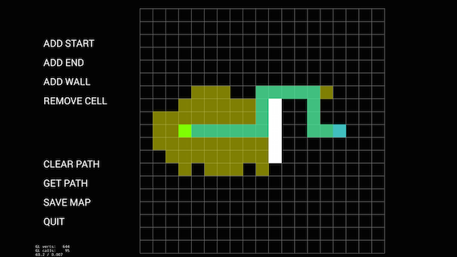
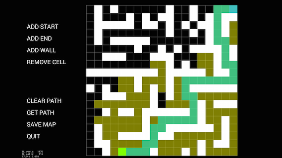
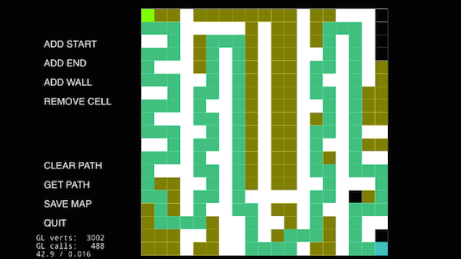

use cocos2d-x3.x to show A Star algorithm.

+ brief:

1. use ***rapidjson*** to ready and write a json that define a simple path search map.

2. map edit by users.

3. moving direction : Up, Down, Right and Left.

